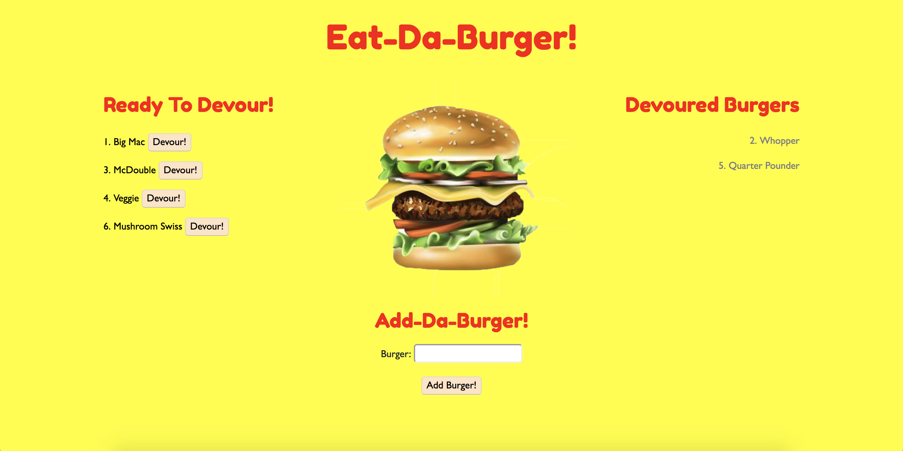

# Sequelized Eat-Da-Burger

Experience here: [Sequelized Eat-Da-Burger](https://intense-brushlands-23599.herokuapp.com/)

Sequelized Eat-Da-Burger is a restuarant app that allows users to do the following:

* Input the name of a burger they would like to eat
* Submitting their burger will add it to the queue of "Ready to Devour" burgers on the left
* Each burger will have a "Devour It!" button
* Clicking the "Devour It!" button will move the burger to the "Devoured Burgers" section on the right
* All burgers and their state are stored in a database

The Eat-Da-Burger app utilizes a Sequelize ORM.

**Tech Used:**
* MySQL
* Sequelize
* Node.js
* Express
* Handlebars
* ORM
* Javascript
* JQuery
* Bootstrap
* CSS

&nbsp;

Designed, built, and maintained by Brian Fitzgerald

Email: brianjfitzgerald@gmail.com

Copyright &#169; 2018